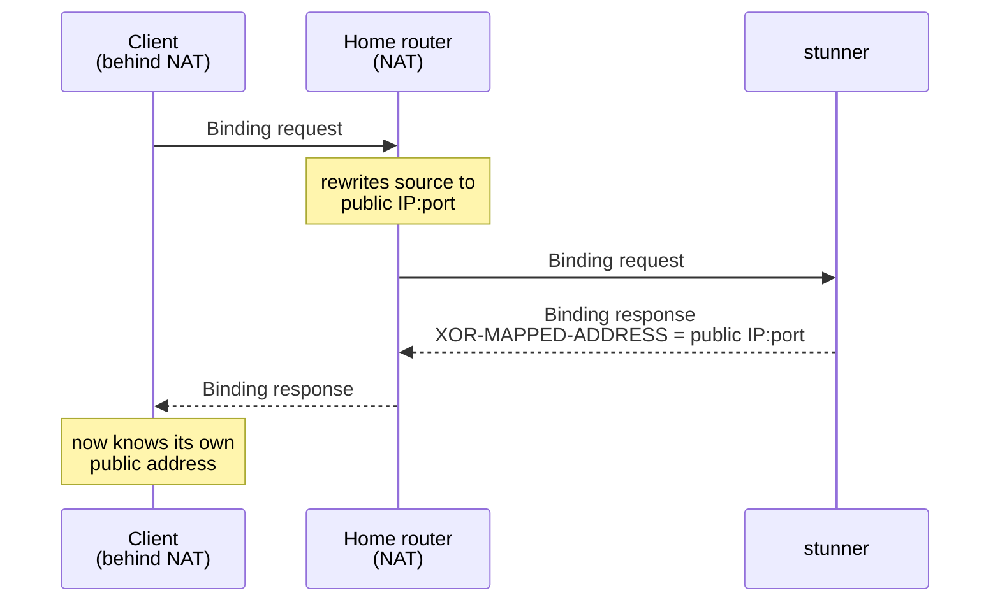

<h1 align="center">
  <br>
  
  <br>
  stunner
  <br>
</h1>
<h4 align="center">A small, fast STUN server written in Go</h4>
<p align="center">
  <a href="https://datatracker.ietf.org/doc/html/rfc8489"></a>
  <a href="go.mod"></a>
  <a href="LICENSE"></a>
</p>
<br>

If your app does video calls, voice chat, multiplayer games, or anything else
peer-to-peer, the catch is that devices behind home routers don't know their
own public address. A STUN server tells them. The device asks what its IP and
port look like from the outside, and the server answers. That one answer is
usually enough for two devices to connect directly.



Reasons to run your own instead of using a public one:

- **Privacy.** Public STUN servers see the IP of every user of your app.
- **Reliability.** You don't depend on someone else's free service staying up.
- **Cost.** STUN is stateless and tiny. The smallest VPS you can rent will
  handle enormous traffic.

### RFCs

#### Implemented

- [RFC 8489](https://datatracker.ietf.org/doc/html/rfc8489) — Session Traversal Utilities for NAT (STUN)
- [RFC 5780](https://datatracker.ietf.org/doc/html/rfc5780) — NAT Behavior Discovery Using STUN
- [RFC 3489](https://datatracker.ietf.org/doc/html/rfc3489) — Classic STUN, for backwards compatibility

### Features

| Feature | Details | Flags |
|---|---|---|
| **Binding over UDP & TCP** | The core STUN exchange WebRTC needs, per [RFC 8489](https://datatracker.ietf.org/doc/html/rfc8489) | on by default |
| **Secure transports** | `stuns` over TLS and DTLS, with certificate rotation picked up without a restart | `-tls-cert` / `-tls-key` |
| **Long-term credential auth** | Including USERHASH and password-algorithm negotiation | `-realm` / `-user` |
| **Per-IP rate limiting** | On by default | `-rps` |
| **NAT behavior discovery** | [RFC 5780](https://datatracker.ietf.org/doc/html/rfc5780), on servers with two IPs | `-alt-ip` |
| **Prometheus metrics** | Per-transport request/reply/error counters | `-metrics-addr` |
| **Classic STUN** | RFC 3489 backwards compatibility | on by default |

#### How it compares

[coturn](https://github.com/coturn/coturn) is the usual open-source choice,
and the right one if you need TURN media relaying. It's a mature C server that
speaks both STUN and TURN, with the configuration surface to match. stunner
does less on purpose: STUN only, in Go, as one static binary with sensible
defaults. There's almost nothing to configure and nothing to link against.
Compared to a public server like Google's `stun.l.google.com`, running your
own buys you the privacy and reliability described above.

### Using

Build the two binaries, start the server, and ask it for your address:

```sh
# Build stund (server) and stunc (client) into ./bin
go build -o bin/stund ./cmd/stund
go build -o bin/stunc ./cmd/stunc

# Start the server — listens on :3478, the standard STUN port
./bin/stund

# In another shell, ask what address the server sees
./bin/stunc 127.0.0.1
# 127.0.0.1:54321      ← your public IP:port as seen from outside
```

With no flags `stund` listens on `:3478`. Use `-addr` to pick a different port
and `-v` to turn on debug logging. Stop it with Ctrl-C. The
[flag reference](cmd/stund/README.md) covers everything `stund` accepts.

`stunc` speaks every transport the server serves, so it doubles as a
deployment check — point it at a real host over any protocol:

```sh
./bin/stunc stun.example.org               # UDP,  port 3478
./bin/stunc -proto tcp stun.example.org    # TCP,  port 3478
./bin/stunc -proto tls stun.example.org    # stuns over TLS,  port 5349
```

To use stunner from an app, point your WebRTC config (or any STUN client) at
`stun:your-host:3478`:

```js
new RTCPeerConnection({
  iceServers: [{ urls: "stun:your-host:3478" }],
});
```

#### Deployment

Docker, systemd, DNS SRV discovery, and monitoring are covered in
[deploy/README.md](deploy/README.md).

#### Documentation

- [docs/](docs/) — **Understanding STUN, one chapter at a time**: a guided
  tour of the protocol taught through this server's code, from the NAT problem
  to running it in production. Start here to learn how STUN works.
- [OVERVIEW.md](OVERVIEW.md) — design, wire-format notes, roadmap, and a
  per-commit progress log
- [CONTRIBUTING.md](CONTRIBUTING.md) — build, run, and test locally
- [deploy/README.md](deploy/README.md) — Docker, systemd, DNS, and monitoring
- [cmd/stund/README.md](cmd/stund/README.md) — the full `stund` flag reference

### Contributing

See [CONTRIBUTING.md](CONTRIBUTING.md) to build, run, and test locally.

### License

MIT License — see [LICENSE](LICENSE).
