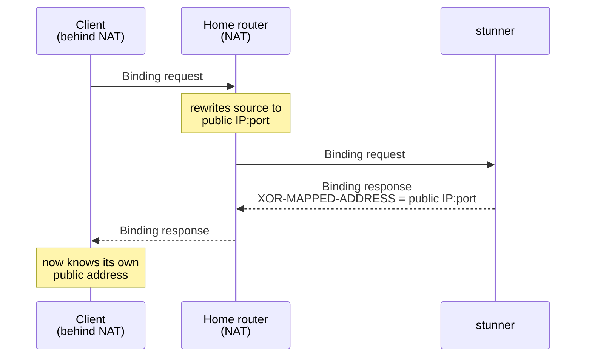

# stunner

A small, fast STUN server written in Go. One binary.

> **Status: feature-complete.** It covers every MUST and SHOULD in RFC 8489:
> Binding over UDP, TCP, TLS, and DTLS, long-term credential auth, NAT
> behavior discovery (RFC 5780), and RFC 3489 "classic STUN" backwards
> compatibility. See the [progress log](OVERVIEW.md#progress-log) for the
> full history.

## What is this for?

If your app does video calls, voice chat, multiplayer games, or anything else
peer-to-peer, the catch is that devices behind home routers don't know their
own public address. A STUN server tells them. The device asks what its IP and
port look like from the outside, and the server answers. That one answer is
usually enough for two devices to connect directly.

Reasons to run your own instead of using a public one:

- **Privacy.** Public STUN servers see the IP of every user of your app.
- **Reliability.** You don't depend on someone else's free service staying up.
- **Cost.** STUN is stateless and tiny. The smallest VPS you can rent will
  handle enormous traffic.

## Quick start

Build it from source and run it. [CONTRIBUTING.md](CONTRIBUTING.md) has the
one-liner. With no flags it listens on `:3478`, the standard STUN port. Use
`-addr` to pick a different port and `-v` to turn on debug logging. Stop it
with Ctrl-C.

Then point your WebRTC config (or any STUN client) at `stun:your-host:3478`.

A companion client, `stunc`, ships in the same repo. It prints back the
address the server saw you as, which is handy for checking a deployment. The
[flag reference](cmd/stund/README.md) covers everything `stund` accepts.

## Features

| Feature | Details | Flags |
|---|---|---|
| **Binding over UDP & TCP** | The core STUN exchange WebRTC needs, per [RFC 8489](https://datatracker.ietf.org/doc/html/rfc8489) | on by default |
| **Secure transports** | `stuns` over TLS and DTLS, with certificate rotation picked up without a restart | `-tls-cert` / `-tls-key` |
| **Long-term credential auth** | Including USERHASH and password-algorithm negotiation | `-realm` / `-user` |
| **Per-IP rate limiting** | On by default | `-rps` |
| **NAT behavior discovery** | [RFC 5780](https://datatracker.ietf.org/doc/html/rfc5780), on servers with two IPs | `-alt-ip` |
| **Prometheus metrics** | Per-transport request/reply/error counters | `-metrics-addr` |
| **Classic STUN** | RFC 3489 backwards compatibility | on by default |

### How it compares

[coturn](https://github.com/coturn/coturn) is the usual open-source choice,
and the right one if you need TURN media relaying. It's a mature C server that
speaks both STUN and TURN, with the configuration surface to match. stunner
does less on purpose: STUN only, in Go, as one static binary with sensible
defaults. There's almost nothing to configure and nothing to link against.
Compared to a public server like Google's `stun.l.google.com`, running your
own buys you the privacy and reliability described above.

## Deployment

Docker, systemd, DNS SRV discovery, and monitoring are covered in
[deploy/README.md](deploy/README.md).

## Documentation

- [OVERVIEW.md](OVERVIEW.md) — design, wire-format notes, roadmap, and a
  per-commit progress log
- [CONTRIBUTING.md](CONTRIBUTING.md) — build, run, and test locally
- [deploy/README.md](deploy/README.md) — Docker, systemd, DNS, and monitoring
- [cmd/stund/README.md](cmd/stund/README.md) — the full `stund` flag reference
- [RFC 8489](https://datatracker.ietf.org/doc/html/rfc8489) — the STUN spec this
  implements, and [RFC 5780](https://datatracker.ietf.org/doc/html/rfc5780) for
  NAT behavior discovery

## License

[MIT](LICENSE)
