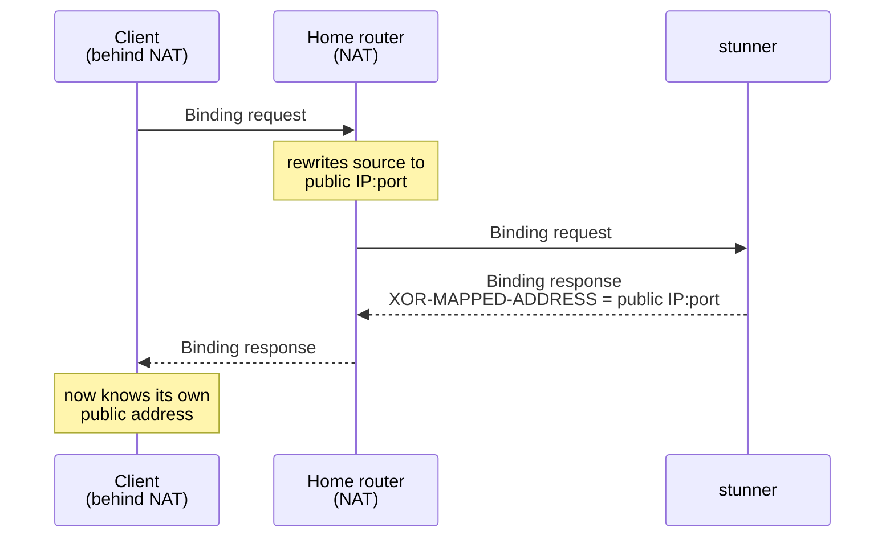

# stunner


A small, fast STUN server written in Go. One binary.

> **Status: feature-complete.** Every MUST and SHOULD in RFC 8489 — Binding
> over UDP, TCP, TLS, and DTLS, long-term credential auth, NAT behavior
> discovery (RFC 5780), even RFC 3489 "classic STUN" backwards compatibility.
> See the [progress log](OVERVIEW.md#progress-log) for the full story.

## What is this for?

If your app does video calls, voice chat, multiplayer games, or any other
peer-to-peer networking, devices behind home routers don't know their own
public address. A STUN server tells them: a device asks *"what's my IP and
port from the outside?"* and the server answers. That one answer is usually
all it takes for two devices to connect directly to each other.



Reasons to run your own instead of using a public one:

- **Privacy** — public STUN servers see the IP of every user of your app.
- **Reliability** — no dependence on someone else's free service staying up.
- **It's cheap** — STUN is stateless and tiny; the smallest VPS you can rent
  will handle enormous traffic.

## Quick start

Build it from source and run it — [CONTRIBUTING.md](CONTRIBUTING.md) has the
one-liner. With no flags it listens on `:3478`, the standard STUN port; `-addr`
picks a different port and `-v` turns on debug logging. Stop it with Ctrl-C.

Then point your WebRTC config (or any STUN client) at `stun:your-host:3478`.

A companion client, `stunc`, ships in the same repo — handy for checking a
deployment, it prints back the address the server saw you as. The
[flag reference](cmd/stund/README.md) covers everything `stund` accepts.

## What it will and won't do

- ✅ STUN Binding over UDP and TCP (the thing WebRTC needs), per [RFC 8489](https://datatracker.ietf.org/doc/html/rfc8489)
- ✅ Secure transports: `stuns` over TLS and DTLS (`-tls-cert`/`-tls-key`),
  with certificate rotation picked up without a restart
- ✅ Long-term credential auth (`-realm`/`-user`), including USERHASH and
  password-algorithm negotiation
- ✅ Per-IP rate limiting, on by default
- ✅ NAT behavior discovery ([RFC 5780](https://datatracker.ietf.org/doc/html/rfc5780)) on servers with two IPs (`-alt-ip`)
- ✅ Prometheus counters (`-metrics-addr`)
- ❌ TURN (media relaying) — different, much heavier protocol; use
  [coturn](https://github.com/coturn/coturn) if you need relaying

### How it compares

[coturn](https://github.com/coturn/coturn) is the usual open-source choice, and
the right one if you need TURN media relaying — a mature C server that speaks
STUN and TURN both, with the configuration surface to match. stunner
deliberately does less: STUN only, in Go, shipping as one static binary with
sensible defaults, so there's next to nothing to configure and nothing to link
against. Against a public server (Google's `stun.l.google.com`, say), running
your own is the privacy and reliability trade described above.

## Deployment

**Docker** — the image is a static binary in an empty (`scratch`) image:

```sh
docker build -t stund -f deploy/Dockerfile .
docker run --rm -p 3478:3478/udp -p 3478:3478/tcp stund
```

**systemd** — a hardened unit lives in [`deploy/stund.service`](deploy/stund.service):

```sh
go build -o /usr/local/bin/stund ./cmd/stund
cp deploy/stund.service /etc/systemd/system/ && systemctl enable --now stund
```

**DNS** — [RFC 8489 §8](https://datatracker.ietf.org/doc/html/rfc8489#section-8)
clients discover servers through SRV records, which also let you move or
load-balance the service later without touching client config:

```dns
_stun._udp.example.org.  IN SRV 0 0 3478 stun.example.org.
_stun._tcp.example.org.  IN SRV 0 0 3478 stun.example.org.
_stuns._tcp.example.org. IN SRV 0 0 5349 stun.example.org.  ; TLS
_stuns._udp.example.org. IN SRV 0 0 5349 stun.example.org.  ; DTLS (RFC 7350)
```

The port numbers in the SRV records are authoritative for clients that look
them up; 3478 (`stun`) and 5349 (`stuns`) are just the defaults for clients
that don't.

**Monitoring** — `-metrics-addr 127.0.0.1:9478` serves per-transport
request/reply/error counters in Prometheus text format on `/metrics`. Bind
it to localhost or an internal interface; it has no auth of its own.

## Documentation

- [OVERVIEW.md](OVERVIEW.md) — design, wire-format notes, roadmap, and a
  per-commit progress log
- [CONTRIBUTING.md](CONTRIBUTING.md) — build, run, and test locally
- [cmd/stund/README.md](cmd/stund/README.md) — the full `stund` flag reference
- [RFC 8489](https://datatracker.ietf.org/doc/html/rfc8489) — the STUN spec this
  implements, and [RFC 5780](https://datatracker.ietf.org/doc/html/rfc5780) for
  NAT behavior discovery

## License

[MIT](LICENSE)
