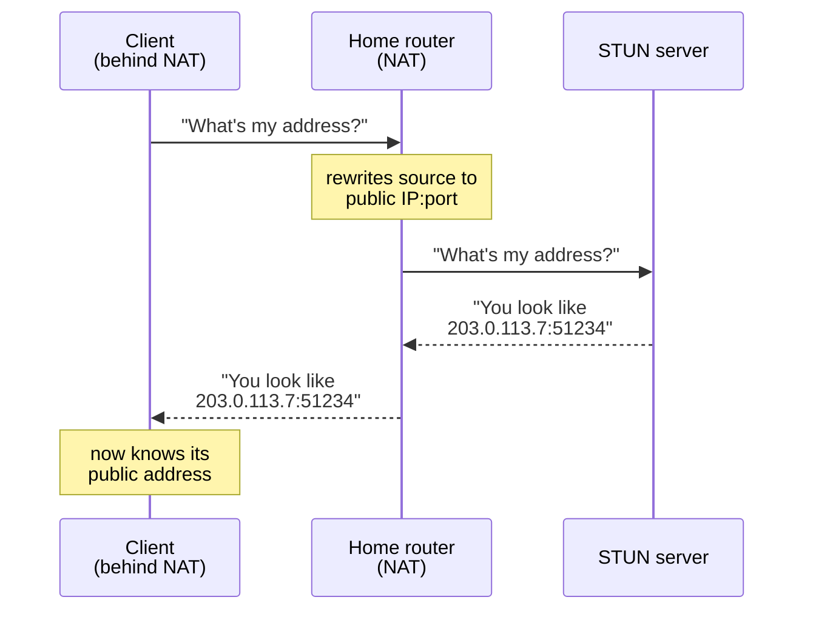

# Chapter 1: The NAT problem

Ask your computer what its IP address is and it will tell you something like
`192.168.1.42`. That address is a lie — or rather, it's a local truth. It's the
address your home router handed out on your private network. To the rest of the
internet, you don't have that address at all. You share one public address with
every other device in the house, and your router juggles them behind it. This
juggling act is called **NAT**, Network Address Translation, and it's why the
internet didn't run out of addresses a decade ago.

NAT is invisible almost all the time. When you load a web page, your request
goes out through the router, the router remembers "this reply belongs to the
laptop," and the answer comes back. You never needed to know your public
address, because you started the conversation.

## The trouble starts when two devices want to talk directly

Now imagine a video call. For the audio and video to flow without bouncing
through a middleman server — which costs money and adds delay — the two devices
want to send packets straight to each other. But neither one knows its own
public address. Each sees only its private `192.168.x.x` address, which is
useless to the other side. It's like trying to give someone directions to your
house when all you know is which bedroom you're standing in.

You could ask the router, but home routers generally won't tell you, and even
if they did, the answer depends on where the packet is going. What you really
need is an outside observer: someone on the public internet who can look at a
packet you sent and report back the address it appears to come from.

## That outside observer is a STUN server

The idea is almost too simple. Your device sends a small packet to a STUN
server and asks, in effect, "what address did this arrive from?" On the way
out, your router rewrites the packet's source address to the public one — that's
just NAT doing its normal job. The STUN server sees the rewritten address,
copies it into a reply, and sends it back. Now your device knows how the
outside world sees it.

That single answer is usually enough. Once each side knows its own public
address, they can trade those addresses (through a signaling channel — a
chat server, say) and start sending packets directly. This is the foundation
under WebRTC video calls, voice chat, and peer-to-peer multiplayer games.

## What STUN is not

STUN tells you your address. That's the whole job. It does **not** relay your
traffic, hold your call open, or remember anything about you between packets.
There's a sister protocol, TURN, that *does* relay traffic for the hard cases
where a direct connection is impossible — but that's a different protocol with
a different cost profile, and this server deliberately doesn't do it. STUN is
the cheap, stateless first thing you try.

"Stateless" is worth pausing on, because it shapes everything that follows. The
server keeps no memory of you. Every request is answered entirely from the
packet in front of it — the return address is right there on the envelope. This
is why a STUN server on the smallest VPS you can rent will shrug off enormous
traffic: there's no per-user state to store, no session to track, nothing to
run out of.

## Why run your own

If STUN is so simple, why not use a public server? Three reasons, and they're
the reasons this project exists:

- **Privacy.** A STUN server sees the IP of every user of your app. A public
  one hands that visibility to a stranger.
- **Reliability.** A free public server can vanish or get overloaded the day
  your product launches. Yours doesn't.
- **Cost.** STUN is so cheap to run that "just run your own" is a real answer.
  The resource it consumes most is the ten minutes it takes to set up.

## Where this is going

The rest of this tutorial takes that one simple exchange apart. The next
chapter looks at exactly what those "what's my address?" packets contain, down
to the byte — because before you can understand how the server answers, you
need to understand the language it answers in.

---

**Read the code**

- [`README.md`](../README.md) — the same pitch, aimed at someone deciding
  whether to run the server.
- [`internal/server/README.md`](../internal/server/README.md) — a one-paragraph
  restatement of the job, from the server's point of view.

---

[Contents](README.md) · **Next:** [Chapter 2: Anatomy of a STUN message →](02-anatomy-of-a-message.md)
